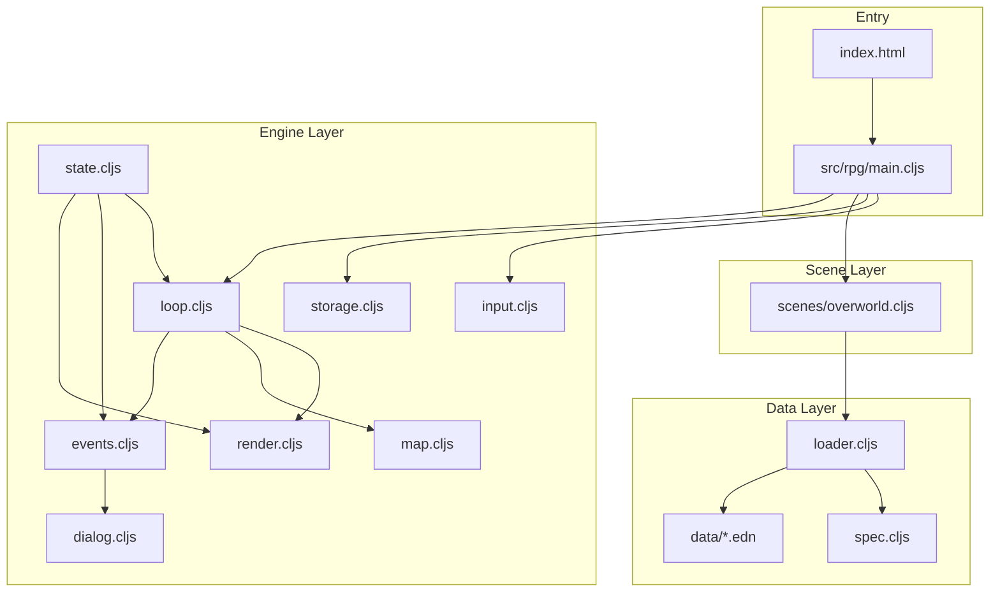

# RPG-CLJS リポジトリ説明

## プロジェクトの目的

**rpg-cljs** は **ClojureScript だけで動く 2D RPG の学習・拡張用スキャフォールド** です。RPGツクール風のイベント DSL、データ駆動設計、テスト可能なエンジン分離を意識した構成になっています。

ブラウザ上で Canvas に描画され、React 等の UI フレームワークは使わず、素の DOM + Canvas 2D で動作します。

---

## 技術スタック

| 項目 | 内容 |
|------|------|
| 言語 | ClojureScript (`.cljs`) |
| ビルド | [shadow-cljs](../shadow-cljs.edn) 2.28.x |
| バリデーション | Malli 0.14.0 |
| データ形式 | EDN（アイテム・敵・マップ） |
| 永続化 | ブラウザ `localStorage` |
| テスト | Node ユニット + ブラウザ結合 |
| デプロイ | GitHub Pages（[`.github/workflows/static.yml`](../.github/workflows/static.yml)） |

---

## ディレクトリ構成



主要パス:

- [`index.html`](../index.html) — Canvas・HUD・ダイアログ UI
- [`src/rpg/main.cljs`](../src/rpg/main.cljs) — エントリポイント（`init` / `reload`）
- [`src/rpg/engine/`](../src/rpg/engine/) — 再利用可能なゲームエンジン
- [`src/rpg/data/`](../src/rpg/data/) — EDN ロード + Malli スキーマ
- [`src/rpg/scenes/overworld.cljs`](../src/rpg/scenes/overworld.cljs) — オーバーワールド初期化
- [`data/`](../data/) — ゲームコンテンツ（EDN）
- [`test/rpg/`](../test/rpg/) — テスト

---

## アーキテクチャの要点

### 1. 単一 atom による状態管理

[`src/rpg/engine/state.cljs`](../src/rpg/engine/state.cljs) の `state` atom に、プレイヤー位置・マップ・イベント・インベントリ・カメラ・ダイアログ・移動アニメなどを集約しています。

```clojure
(defonce state (atom {:player {:x 0 :y 0 :dir :down}
                      :map {} :events {} :inventory {} ...}))
```

### 2. エンジン / シーンの分離

- **engine/** — マップ移動、描画、入力、イベント解釈など汎用ロジック
- **scenes/** — 特定シーンのデータ読み込み（現状は overworld のみ）

### 3. データ駆動 + Malli 検証

起動時に [`loader.cljs`](../src/rpg/data/loader.cljs) が EDN を fetch し、[`spec.cljs`](../src/rpg/data/spec.cljs) の Malli スキーマで検証してから state に反映します。データ不整合を早期に検出できます。

コンテンツ例（[`data/maps/overworld.edn`](../data/maps/overworld.edn)）:

- `tiles` — `[x y tileId]` のタイル配置
- `events` — 座標に紐づくイベント定義

### 4. RPGツクール風イベント DSL

[`src/rpg/engine/events.cljs`](../src/rpg/engine/events.cljs) が座標ベースのイベントを解釈します。

対応コマンド:

- `:say` — 会話表示
- `:chest` — 宝箱（一度きり開封管理）
- `:warp` — 座標ワープ
- `:give-item` — アイテム付与

プレイヤーがタイルに入ると `trigger-at!` が script ベクタを順次実行します。

### 5. ゲームループ

[`loop.cljs`](../src/rpg/engine/loop.cljs) が `requestAnimationFrame` で毎フレーム:

- 移動アニメーション
- ダイアログ中の入力ブロック
- カメラ追従
- Canvas 描画

を処理します。

### 6. セーブ / ロード

[`storage.cljs`](../src/rpg/engine/storage.cljs) が `localStorage` に `player` / `opened`（開封済み宝箱）/ `inventory` / `map` を保存。ページ離脱時（`beforeunload`）にも自動保存します。

---

## 起動フロー

[`main.cljs`](../src/rpg/main.cljs) の `init` 処理:

1. キー入力を attach
2. セーブデータを load
3. 初回描画（プレイヤー・カメラ）
4. `OW/seed!` で EDN データを非同期ロード
5. ロード完了後にゲームループ開始 + 初期位置でイベント発火

開発時は shadow-cljs の `:after-load rpg.main/reload` でホットリロード対応。

```mermaid
sequenceDiagram
  participant Main as main/init
  participant Input as input.cljs
  participant Store as storage.cljs
  participant Render as render.cljs
  participant OW as overworld/seed!
  participant Loop as loop.cljs
  participant Events as events.cljs

  Main->>Input: attach!
  Main->>Store: load-game!
  Main->>Render: initial draw
  Main->>OW: seed! (async)
  OW-->>Main: data loaded
  Main->>Loop: step!
  Main->>Events: trigger-at! at player pos
```

---

## ビルド・テスト・開発

[`package.json`](../package.json) のスクリプト:

| コマンド | 用途 |
|----------|------|
| `npm run watch` | 開発ウォッチ（`:app` ビルド） |
| `npm run build` | 本番ビルド → `js/main.js` |
| `npm run test:node` | Node 上の純ロジックテスト |
| `npm run test:browser:watch` | ブラウザ結合テスト |

[`shadow-cljs.edn`](../shadow-cljs.edn) では 3 ビルドターゲット:

- `:app` — ブラウザ本番/開発
- `:node-test` — Node テスト
- `:browser-test` — ブラウザテスト

---

## 設計上の特徴

- **未定義タイルは自動で草 (0)** — 全マップを事前に敷く必要なし
- **イベントは座標にぶら下げ** — ロジックは `events.cljs` に集中
- **EDN は起動時に Malli 検証** — データ不整合を早期検知

---

## 今後の拡張アイデア（未実装）

- 戦闘シーン（`:battle` DSL + `engine/battle.cljs`）
- 複数マップ切替
- test.check によるプロパティテスト
- サーバー保存（Transit/JSON）

---

## まとめ

**rpg-cljs** は、ClojureScript のゲーム開発を学ぶための小さく整理された 2D RPG 基盤です。フレームワークに依存せず、データ駆動・テスト可能・REPL 駆動開発（shadow-cljs）を前提に設計されています。現状はオーバーワールド 1 マップ + 基本イベント（会話・宝箱・ワープ）が動作する最小構成で、戦闘などは拡張ポイントとして残されています。
